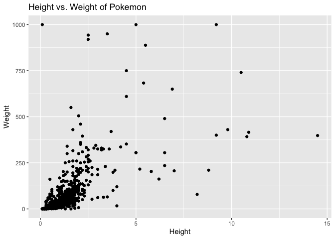

<!-- README.md is generated from README.Rmd. Please edit that file -->

# pokemon

<!-- badges: start -->

[](https://lifecycle.r-lib.org/articles/stages.html#stable)
[](https://CRAN.R-project.org/package=pokemon)
[](https://github.com/williamorim/pokemon/actions/workflows/R-CMD-check.yaml)
<!-- badges: end -->

This package provides a dataset of Pokemon information in both English
and Brazilian Portuguese. The dataset contains 949 rows and 22 columns,
including information such as the Pokemon’s name, ID, height, weight,
stats, type, and more.

## Installation

You can install the pokemon package with:

``` r
install.packages("pokemon")
```

You can install the development version of pokemon from
[GitHub](https://github.com/) with:

``` r
# install.packages("devtools")
remotes::install_github("williamorim/pokemon")
```

## Example

This is a basic example of pokemon data

``` r
library(pokemon)

dplyr::glimpse(pokemon)
#> Rows: 949
#> Columns: 22
#> $ id              <dbl> 1, 2, 3, 4, 5, 6, 7, 8, 9, 10, 11, 12, 13, 14, 15, 16,…
#> $ pokemon         <chr> "bulbasaur", "ivysaur", "venusaur", "charmander", "cha…
#> $ species_id      <dbl> 1, 2, 3, 4, 5, 6, 7, 8, 9, 10, 11, 12, 13, 14, 15, 16,…
#> $ height          <dbl> 0.7, 1.0, 2.0, 0.6, 1.1, 1.7, 0.5, 1.0, 1.6, 0.3, 0.7,…
#> $ weight          <dbl> 6.9, 13.0, 100.0, 8.5, 19.0, 90.5, 9.0, 22.5, 85.5, 2.…
#> $ base_experience <dbl> 64, 142, 236, 62, 142, 240, 63, 142, 239, 39, 72, 178,…
#> $ type_1          <chr> "grass", "grass", "grass", "fire", "fire", "fire", "wa…
#> $ type_2          <chr> "poison", "poison", "poison", NA, NA, "flying", NA, NA…
#> $ hp              <dbl> 45, 60, 80, 39, 58, 78, 44, 59, 79, 45, 50, 60, 40, 45…
#> $ attack          <dbl> 49, 62, 82, 52, 64, 84, 48, 63, 83, 30, 20, 45, 35, 25…
#> $ defense         <dbl> 49, 63, 83, 43, 58, 78, 65, 80, 100, 35, 55, 50, 30, 5…
#> $ special_attack  <dbl> 65, 80, 100, 60, 80, 109, 50, 65, 85, 20, 25, 90, 20, …
#> $ special_defense <dbl> 65, 80, 100, 50, 65, 85, 64, 80, 105, 20, 25, 80, 20, …
#> $ speed           <dbl> 45, 60, 80, 65, 80, 100, 43, 58, 78, 45, 30, 70, 50, 3…
#> $ color_1         <chr> "#78C850", "#78C850", "#78C850", "#F08030", "#F08030",…
#> $ color_2         <chr> "#A040A0", "#A040A0", "#A040A0", NA, NA, "#A890F0", NA…
#> $ color_f         <chr> "#81A763", "#81A763", "#81A763", NA, NA, "#DE835E", NA…
#> $ egg_group_1     <chr> "monster", "monster", "monster", "monster", "monster",…
#> $ egg_group_2     <chr> "plant", "plant", "plant", "dragon", "dragon", "dragon…
#> $ url_icon        <chr> "//archives.bulbagarden.net/media/upload/7/7b/001MS6.p…
#> $ generation_id   <dbl> 1, 1, 1, 1, 1, 1, 1, 1, 1, 1, 1, 1, 1, 1, 1, 1, 1, 1, …
#> $ url_image       <chr> "https://raw.githubusercontent.com/HybridShivam/Pokemo…
dplyr::glimpse(pokemon_ptbr)
#> Rows: 949
#> Columns: 22
#> $ id              <dbl> 1, 2, 3, 4, 5, 6, 7, 8, 9, 10, 11, 12, 13, 14, 15, 16,…
#> $ pokemon         <chr> "bulbasaur", "ivysaur", "venusaur", "charmander", "cha…
#> $ id_especie      <dbl> 1, 2, 3, 4, 5, 6, 7, 8, 9, 10, 11, 12, 13, 14, 15, 16,…
#> $ altura          <dbl> 0.07, 0.10, 0.20, 0.06, 0.11, 0.17, 0.05, 0.10, 0.16, …
#> $ peso            <dbl> 0.69, 1.30, 10.00, 0.85, 1.90, 9.05, 0.90, 2.25, 8.55,…
#> $ exp_base        <dbl> 64, 142, 236, 62, 142, 240, 63, 142, 239, 39, 72, 178,…
#> $ tipo_1          <chr> "grama", "grama", "grama", "fogo", "fogo", "fogo", "ág…
#> $ tipo_2          <chr> "venenoso", "venenoso", "venenoso", NA, NA, "voador", …
#> $ hp              <dbl> 45, 60, 80, 39, 58, 78, 44, 59, 79, 45, 50, 60, 40, 45…
#> $ ataque          <dbl> 49, 62, 82, 52, 64, 84, 48, 63, 83, 30, 20, 45, 35, 25…
#> $ defesa          <dbl> 49, 63, 83, 43, 58, 78, 65, 80, 100, 35, 55, 50, 30, 5…
#> $ ataque_especial <dbl> 65, 80, 100, 60, 80, 109, 50, 65, 85, 20, 25, 90, 20, …
#> $ defesa_especial <dbl> 65, 80, 100, 50, 65, 85, 64, 80, 105, 20, 25, 80, 20, …
#> $ velocidade      <dbl> 45, 60, 80, 65, 80, 100, 43, 58, 78, 45, 30, 70, 50, 3…
#> $ cor_1           <chr> "#78C850", "#78C850", "#78C850", "#F08030", "#F08030",…
#> $ cor_2           <chr> "#A040A0", "#A040A0", "#A040A0", NA, NA, "#A890F0", NA…
#> $ cor_final       <chr> "#81A763", "#81A763", "#81A763", NA, NA, "#DE835E", NA…
#> $ grupo_ovo_1     <chr> "monster", "monster", "monster", "monster", "monster",…
#> $ grupo_ovo_2     <chr> "plant", "plant", "plant", "dragon", "dragon", "dragon…
#> $ url_icone       <chr> "//archives.bulbagarden.net/media/upload/7/7b/001MS6.p…
#> $ url_imagem      <chr> "https://raw.githubusercontent.com/HybridShivam/Pokemo…
#> $ id_geracao      <dbl> 1, 1, 1, 1, 1, 1, 1, 1, 1, 1, 1, 1, 1, 1, 1, 1, 1, 1, …
```

A basic plot:

``` r
library(ggplot2)

# Create scatter plot
ggplot(pokemon, aes(x = height, y = weight)) +
  geom_point() +
  labs(
    title = "Height vs. Weight of Pokemon",
    x = "Height",
    y = "Weight"
  )
```



## License

MIT
